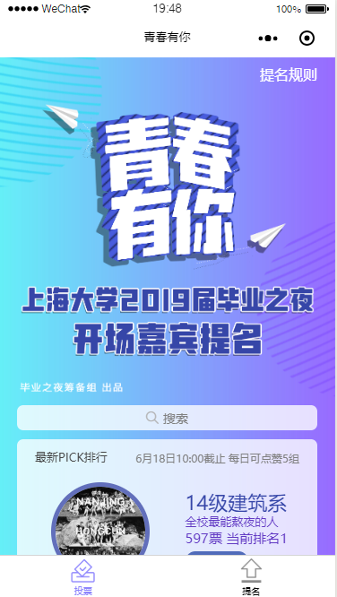
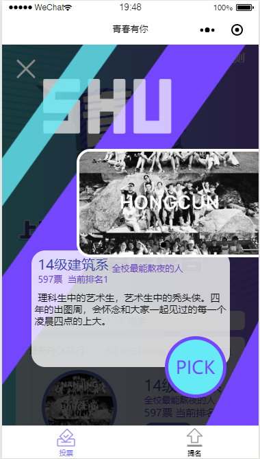
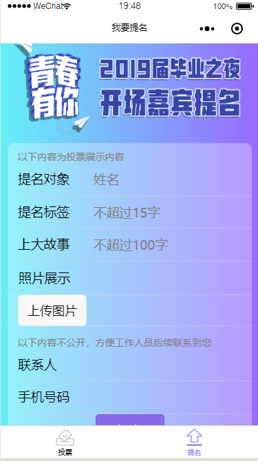
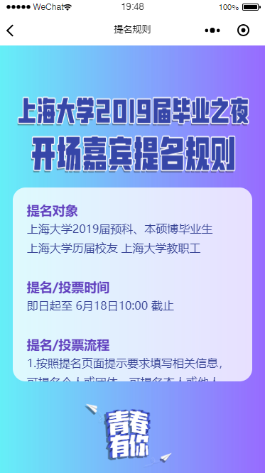

# 上海大学2019届毕业之夜开场嘉宾提名微信小程序

- ## 项目历时

    2019.06.03-2019.06.13

- ## 使用技术  

    原生微信小程序开发  
    服务端使用小程序云开发功能（云数据库、云函数、云存储）

- ## 项目功能模块

  - 提名list展示  
  
  - 嘉宾遮罩层展示  
  
  - 提交  
  
  - 提交成功  
  - 规则  
  
